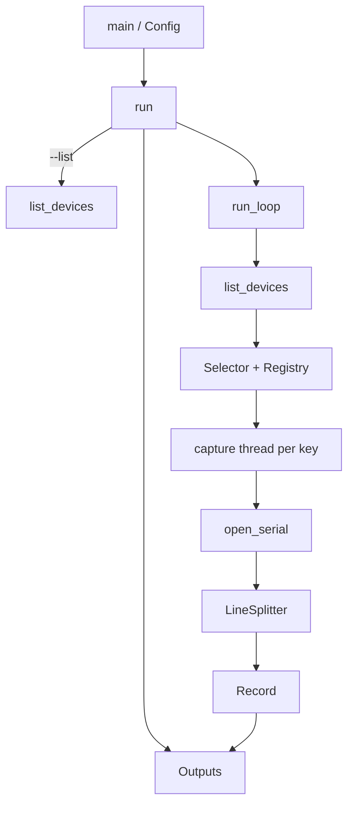

# Architecture

`serial-capture` is a Rust CLI. `main` parses flags into `Config` and calls `serial_capture::run`. Capture work lives in library modules so tests can inject listers, openers, and a stop flag.

## Modules

| Module | Role |
|--------|------|
| `config` | Clap flags, output defaults, poll interval |
| `device` | USB tty scan, identity, selector, path registry |
| `capture` | Poll loop, per-device threads, line split, serial open |
| `output` | Text / JSON / CSV writers |

## Runtime

1. Apply output defaults (`text=-` when no format is set and `--list` is off).
2. Open log destinations (append; CSV header if the file is empty).
3. Poll for devices every `--poll-ms` (minimum 1 ms).
4. For each selected target that does not already have a thread, spawn one keyed by USB identity (auto mode) or by the requested path (explicit `--device`).
5. Each thread opens the current path from the registry, reads until EOF/error/stop, emits complete lines, then retries after `poll_ms`.

Serial reads use a 100 ms timeout so the stop flag can be checked without blocking indefinitely.

## Related

- [Reconnect and identity](features/reconnect.md)
- [Log formats](features/log-formats.md)
- [CLI](features/cli.md)
