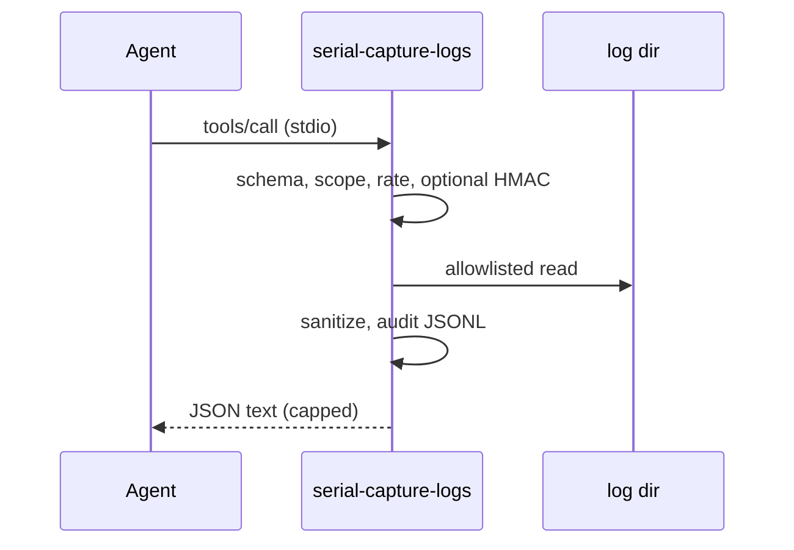

# MCP (serial-capture-logs)

Read-only stdio server so agents can list USB serial devices and search capture logs without starting capture or touching arbitrary files.

Binary: `serial-capture-mcp`. Cursor config: `.cursor/mcp.json`. Server readme: [mcp/serial-logs/README.md](../mcp/serial-logs/README.md).

## Tools

| Tool | Scope | Notes |
|------|-------|--------|
| `list_devices` | `devices:list` | Same discovery as `serial-capture --list`. Does not open ports. |
| `list_logs` | `logs:read` | Names under `SERIAL_CAPTURE_LOG_DIR` with allowlisted extensions. Skips `mcp-audit*`. |
| `search_logs` | `logs:read` | Literal substring, `limit` 1–50. Optional `file`. |
| `read_log` | `logs:read` | Last 1–200 lines of one allowlisted file. |
| `mcp_inventory` | `inventory:read` | SHA-256 fingerprints of name + description + schema. |

Unknown JSON fields are rejected. Responses are capped at 64 KiB. Device serial lines are treated as untrusted: PEM/AWS-key/`password=`/`token=` patterns are redacted, and `ignore previous instructions` is stripped.

## Start

```bash
make mcp
```

Cursor `.cursor/mcp.json` is stdio and launches `target/debug/serial-capture-mcp`. Build it first (`cargo build --bin serial-capture-mcp`), then reload MCP. Log tools need `SERIAL_CAPTURE_LOG_DIR` (defaults unset; Cursor config points at `./logs`).

Compose sandbox (no Docker on some hosts; CI still builds the image):

```bash
docker compose run --rm -T mcp
```

## Threat model

| Boundary | Who | Data | If a tool is fully compromised |
|----------|-----|------|--------------------------------|
| Cursor host stdio | Local agent as the operator | Capture logs (may contain console secrets), USB VID/PID/serial strings | Read allowlisted log files and device names. Cannot write serial, spawn a shell, or leave the log directory. |
| Compose `mcp` service | Same tools, isolated process | `./logs` mounted read-only | Same, plus no network and a read-only root filesystem. |
| Gateway (production) | Filtering proxy | Inspectable JSON tool results | Server should not be reachable except from the gateway. This build has no TCP bind. |

Assume prompt injection in every log line. Outputs are sanitized and must not include “next tool to call” instructions.

## NSA CSI PP-26-1834

| # | Requirement | This server |
|---|----------------|-------------|
| 1 | Filtering proxy | Stdio only. Production: do not expose TCP; put a gateway in front of any remote MCP. |
| 2 | Content controls | Strict schemas, 64 KiB request/response caps, 30 calls / 10 s, 8 MiB file cap. |
| 3 | Indirect prompt injection | Output sanitization; no executable markup in results. |
| 4 | Output logging | Hash-chained JSONL (`MCP_AUDIT_PATH`); params fingerprint + result hash, not raw secrets. |
| 5 | Tool inventory pinning | `mcp_inventory` fingerprints; bump `1.0.0` when schemas change. |
| 6 | SIEM-ready audit | One `mcp.tool.result` event per call (allow, deny, error). |
| 7 | OS sandbox | Compose: `network_mode: none`, `read_only`, `cap_drop: ALL`, `no-new-privileges`, non-root `capture` user, tmpfs `/tmp`. |
| 8 | Per-message signing | HMAC-SHA256 envelopes (`_sig`) when `MCP_HMAC_KEY` is set. `MCP_REQUIRE_SIGNING=1` fail-closes unsigned calls. Cursor stdio does not sign; that gap is documented. TLS is N/A for stdio. |
| 9 | Local discovery | Transport is stdio (no port). Inventory via `mcp_inventory`. |

### Ecosystem gap (requirement 8)

Per-message MCP signing is not universal in Cursor stdio. Hooks exist (`sign_envelope` / `verify_envelope`, key id `mcp-hmac-1`, nonce replay cache, RFC 3339 expiry). Enable `MCP_REQUIRE_SIGNING=1` only when the gateway wraps calls.

### Auth

If `MCP_GATEWAY_TOKEN` is set, `MCP_CALLER_TOKEN` must match or the call is denied. `MCP_SCOPES` defaults to the three read scopes. There are no write scopes.

## Diagram



## Related

- [Log formats](features/log-formats.md)
- [Docker](features/docker.md)
- [Security audit](security-audit.md)
